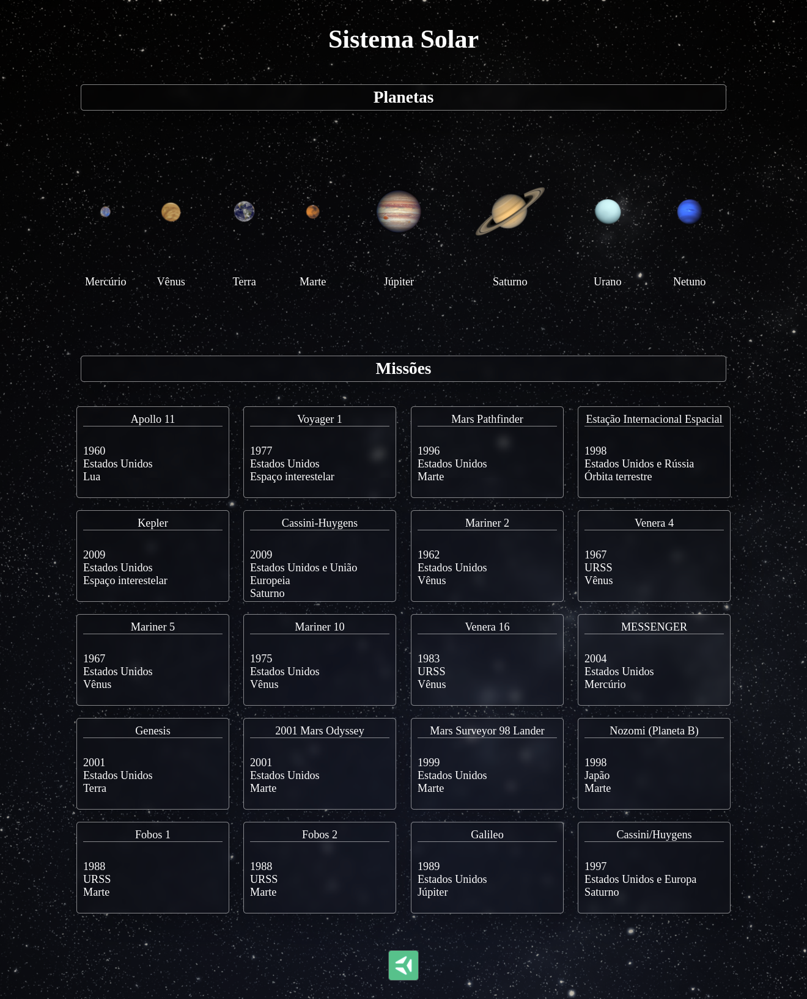

# Project Solar System

- [Acesse aqui a página web do projeto](https://igorhleal.github.io/solar-system-project/)
- [Imagem do resultado final do projeto](#imagem-do-resultado-final-do-projeto)

---

Neste projeto desenvolvi um modelo do sistema solar! Ao utilizar essa aplicação uma pessoa usuária deverá ser capaz de:

  * Visualizar todos os planetas do sistema solar renderizados na tela;

  * Visualizar todas as cartas com informações sobre missões espaciais;

---

Foi verificada a minha capacidade de:

  * Utilizar JSX no React

  * Utilizar corretamente o método `render()` para renderizar seus componentes

  * Utilizar `import` para trazer componentes em diferentes arquivos

  * Criar componentes de classe em React

  * Criar múltiplos componentes a partir de um array

  * Fazer uso de `props` corretamente

  * Fazer uso de `PropTypes` para validar as `props de um componente`

---

# Imagem do resultado final do projeto

